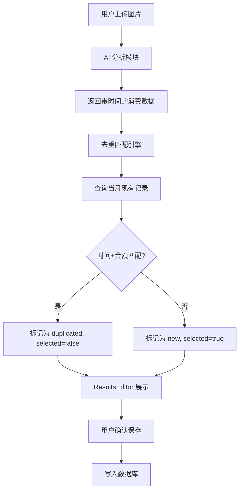

# Design Document: Expense Time Deduplication

## Overview

本设计文档描述了为 AI 智能记账系统添加时间精度和去重匹配功能的技术方案。核心目标是：
1. 扩展数据库以存储精确到小时和分钟的交易时间
2. 修改 AI 分析提示词以提取交易时间
3. 实现去重匹配引擎，通过时间+金额识别重复记录
4. 更新 UI 以展示去重状态和优化日期显示

## Architecture



## Components and Interfaces

### 1. Database Schema Changes

修改 `expenses` 表，将 `date DATE` 改为 `transaction_datetime TIMESTAMP`：

```sql
-- 修改 expenses 表结构
ALTER TABLE expenses 
  DROP COLUMN date,
  ADD COLUMN transaction_datetime TIMESTAMP WITH TIME ZONE NOT NULL DEFAULT NOW();

-- 更新索引
DROP INDEX IF EXISTS idx_expenses_date;
CREATE INDEX idx_expenses_datetime ON expenses(transaction_datetime);
```

### 2. Gemini Service Updates

修改 `src/lib/geminiService.js` 中的 prompt，让 AI 提取交易时间：

```javascript
// 更新 createAnalysisPrompt 函数
function createAnalysisPrompt(today) {
  return `你是一个专业的收据/账单识别助手。请分析这张图片，提取所有消费记录。

今天的日期是：${today}

请以 JSON 格式返回结果，格式如下：
{
  "expenses": [
    {
      "date": "YYYY-MM-DD",
      "time": "HH:mm" 或 null,  // 新增：交易时间，如果图片中可见
      "amount": 数字,
      "category": "分类名称",
      "description": "消费描述",
      "is_essential": true/false
    }
  ]
}

注意事项：
1. 如果图片中显示了具体的交易时间（小时:分钟），请提取到 time 字段
2. 如果没有显示时间，time 字段返回 null
3. 日期格式必须为 YYYY-MM-DD
4. 时间格式必须为 HH:mm（24小时制）
...`;
}
```

### 3. Deduplication Engine

新增 `src/lib/deduplicationService.js`：

```javascript
/**
 * 去重匹配引擎
 * 通过时间（精确到分钟）和金额匹配重复记录
 */
export class DeduplicationService {
  /**
   * 检查单条记录是否与现有记录重复
   * @param {Object} newExpense - AI 返回的新记录 { date, time, amount }
   * @param {Array} existingExpenses - 数据库中的现有记录
   * @returns {boolean} - 是否重复
   */
  static isDuplicate(newExpense, existingExpenses) {
    if (!newExpense.time) return false; // 没有时间信息无法精确匹配
    
    const newDateTime = `${newExpense.date} ${newExpense.time}`;
    const newAmount = parseFloat(newExpense.amount);
    
    return existingExpenses.some(existing => {
      const existingDateTime = formatDateTimeForComparison(existing.transaction_datetime);
      const existingAmount = parseFloat(existing.amount);
      
      return existingDateTime === newDateTime && existingAmount === newAmount;
    });
  }

  /**
   * 批量标记重复状态
   * @param {Array} newExpenses - AI 返回的记录列表
   * @param {Array} existingExpenses - 数据库中的现有记录
   * @returns {Array} - 带有 isDuplicated 和 selected 状态的记录列表
   */
  static markDuplicates(newExpenses, existingExpenses) {
    return newExpenses.map(expense => {
      const isDuplicated = this.isDuplicate(expense, existingExpenses);
      return {
        ...expense,
        isDuplicated,
        selected: !isDuplicated // 重复的不勾选，新的默认勾选
      };
    });
  }
}

/**
 * 格式化数据库时间戳为比较格式 "YYYY-MM-DD HH:mm"
 */
function formatDateTimeForComparison(timestamp) {
  const date = new Date(timestamp);
  const year = date.getFullYear();
  const month = String(date.getMonth() + 1).padStart(2, '0');
  const day = String(date.getDate()).padStart(2, '0');
  const hours = String(date.getHours()).padStart(2, '0');
  const minutes = String(date.getMinutes()).padStart(2, '0');
  return `${year}-${month}-${day} ${hours}:${minutes}`;
}
```

### 4. Service Layer Updates

修改 `src/lib/services.js` 中的 `ExpenseService`：

```javascript
export class ExpenseService {
  static async getExpensesByMonth(year, month) {
    const startDate = new Date(year, month - 1, 1);
    const endDate = new Date(year, month, 0, 23, 59, 59);

    const { data, error } = await supabase
      .from('expenses')
      .select(`*, categories (id, name, emoji)`)
      .gte('transaction_datetime', startDate.toISOString())
      .lte('transaction_datetime', endDate.toISOString())
      .order('transaction_datetime', { ascending: true });

    if (error) throw error;
    return data;
  }

  static async createExpense(expense) {
    // 组合 date 和 time 为 transaction_datetime
    const datetime = expense.time 
      ? `${expense.date}T${expense.time}:00`
      : `${expense.date}T00:00:00`;
    
    const { data, error } = await supabase
      .from('expenses')
      .insert([{
        transaction_datetime: datetime,
        amount: expense.amount,
        category_id: expense.category_id,
        note: expense.note,
        is_essential: expense.is_essential
      }])
      .select()
      .single();

    if (error) throw error;
    return data;
  }
}
```

### 5. UI Component Updates

修改 `src/components/AIExpenseModal.jsx` 中的 `ResultsEditor`：

```jsx
function ResultsEditor({ expenses, categories, currentMonth, onExpensesChange, onConfirm, isSaving }) {
  // ... existing code ...

  return (
    <table>
      <thead>
        <tr>
          <th>Select</th>
          <th>Status</th>        {/* 新增：状态列 */}
          <th>Date/Time</th>     {/* 修改：日期时间列 */}
          <th>Category</th>
          <th>Description</th>
          <th>Essential</th>
          <th>Amount</th>
        </tr>
      </thead>
      <tbody>
        {expenses.map(expense => (
          <tr key={expense.id} className={expense.isDuplicated ? 'opacity-60' : ''}>
            <td><input type="checkbox" checked={expense.selected} /></td>
            <td>
              {expense.isDuplicated ? (
                <span className="text-amber-500">Duplicated</span>
              ) : (
                <span className="text-green-500">New</span>
              )}
            </td>
            <td>
              {/* 只显示日，加上时间 */}
              {new Date(expense.date).getDate()}日
              {expense.time && <span className="text-gray-400 ml-1">{expense.time}</span>}
            </td>
            {/* ... other columns ... */}
          </tr>
        ))}
      </tbody>
    </table>
  );
}
```

## Data Models

### Expense Record (Database)

```typescript
interface ExpenseRecord {
  id: string;                      // UUID
  transaction_datetime: string;    // TIMESTAMP WITH TIME ZONE
  amount: number;                  // DECIMAL(10, 2)
  category_id: string;             // UUID, FK to categories
  note: string | null;             // TEXT
  is_essential: boolean;           // BOOLEAN
  created_at: string;              // TIMESTAMP
  updated_at: string;              // TIMESTAMP
}
```

### AI Response Expense

```typescript
interface AIExpense {
  date: string;           // "YYYY-MM-DD"
  time: string | null;    // "HH:mm" or null
  amount: number;
  category: string;
  description: string;
  is_essential: boolean;
}
```

### Editor Expense (UI State)

```typescript
interface EditorExpense {
  id: string;             // Generated unique ID
  date: string;           // "YYYY-MM-DD"
  time: string | null;    // "HH:mm" or null
  amount: number;
  category_id: string;
  description: string;
  is_essential: boolean;
  selected: boolean;      // Checkbox state
  isDuplicated: boolean;  // Duplicate detection result
  sourceImageIndex?: number;
}
```

## Correctness Properties

*A property is a characteristic or behavior that should hold true across all valid executions of a system—essentially, a formal statement about what the system should do. Properties serve as the bridge between human-readable specifications and machine-verifiable correctness guarantees.*

### Property 1: Time Storage Round-Trip

*For any* expense record with a valid time value, storing it to the database and retrieving it should preserve the hour and minute precision.

**Validates: Requirements 1.1, 1.2**

### Property 2: Duplicate Detection Accuracy

*For any* pair of expense records, they should be marked as duplicates if and only if both their transaction time (hour:minute) AND amount are exactly equal.

**Validates: Requirements 3.1, 3.2**

### Property 3: Selection State Consistency

*For any* expense record returned from deduplication, its `selected` state should be `true` if `isDuplicated` is `false`, and `false` if `isDuplicated` is `true`.

**Validates: Requirements 3.3, 3.4, 3.5**

### Property 4: Date Display Format

*For any* expense record, the displayed date should show only the day number (1-31), with optional time in "HH:mm" format when available.

**Validates: Requirements 4.4, 4.5**

### Property 5: Save Operation Completeness

*For any* set of expense records where some are selected, the save operation should persist exactly the selected records to the database, regardless of their duplicate status.

**Validates: Requirements 5.2**

## Error Handling

| Error Scenario | Handling Strategy |
|----------------|-------------------|
| AI 无法提取时间 | `time` 字段返回 null，去重匹配跳过该记录 |
| 数据库查询失败 | 显示错误提示，允许重试 |
| 时间格式无效 | 在 parseGeminiResponse 中验证并修正 |
| 保存重复记录 | 显示警告但允许继续保存 |

## Testing Strategy

### Unit Tests

1. **Time Parsing Tests**
   - 测试 AI 响应中时间字段的解析
   - 测试无效时间格式的处理

2. **Deduplication Logic Tests**
   - 测试完全匹配（时间+金额相同）
   - 测试部分匹配（只有时间或金额相同）
   - 测试无时间记录的处理

3. **Date Formatting Tests**
   - 测试日期只显示日的格式化
   - 测试时间的条件显示

### Property-Based Tests

使用 fast-check 库进行属性测试：

1. **Property 1**: 生成随机时间戳，验证存储和读取的一致性
2. **Property 2**: 生成随机记录对，验证去重逻辑的正确性
3. **Property 3**: 生成随机记录列表，验证选择状态与重复状态的一致性
4. **Property 5**: 生成随机选择状态，验证保存操作的完整性

每个属性测试运行至少 100 次迭代。
